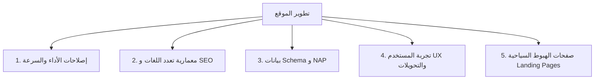

# خطة التطوير والتعديلات التقنية الشاملة للموقع الإلكتروني
## Kardeşler Kebap & Cafe Cihangir — [kardeslercihangir.com](https://www.kardeslercihangir.com)

تم استخلاص وفصل هذا الدليل التقني الشامل من **تقرير التدقيق الرقمي وخطة الهيمنة التسويقية**، ليكون مرجعاً هندسياً وتنفيذياً مخصصاً للمطورين وفرق العمل التقنية لإصلاح وتطوير الموقع الإلكتروني ومحركات البحث وتجربة المستخدم.

---

## 🎯 الأهداف التقنية الرئيسية
1. **التحول من مجرد "منيو رقمي داخلي" إلى منصة تسويق سياحية عالمية متعددة اللغات** تتصدر نتائج بحث Google للسياح (عربي، إنجليزي، روسي، فارسي، فرنسي، تركي).
2. **تحسين الأداء وسرعة التحميل (Core Web Vitals)** والوصول بدرجة أداء الهاتف المحمول إلى **90+** وخفض زمن الاستجابة TTFB إلى أقل من **600ms**.
3. **تصحيح بنية الـ SEO والبيانات المنظمة (Structured Data / Schema.org)** وحل تضارب الـ NAP (الاسم، العنوان، الهاتف، ساعات العمل).
4. **تفعيل مسارات التحويل المباشر (Conversion Funnels)**: حجز الطاولات، طلبات الواتساب، والاتجاهات الدقيقة عبر الخرائط.

---

## 📋 جدول المهام التقنية المصنفة حسب الأولوية

---

## 1. إصلاحات الأداء والسرعة (Performance & Core Web Vitals) 🚀

| # | المشكلة التقنية | الأثر والتشخيص الحالي | الإجراء التقني المطلوب | الأولوية |
|---|---|---|---|---|
| **1.1** | **زمن استجابة الخادم (TTFB)** | يبلغ ~3.2 ثانية في بعض عينات الفحص على Vercel/Next.js. | تفعيل الـ Static Generation (SSG) / ISR الكامل للصفحات الثابتة، وضبط الـ Edge Caching ورؤوس التخزين المؤقت `Cache-Control`. | **حرجة (P0)** |
| **1.2** | **ضغط وتحسين الصور وأصول الهيرو** | صورة الهيرو `hero-bg.png` تصل إلى 901KB، والشعار 210KB. | تحويل كل الصور إلى صيغة **WebP / AVIF الحديثة**، وضغط الشعار بصيغة SVG/WebP بحجم أقل من **40KB**، والهيرو أقل من **60KB**. | **حرجة (P0)** |
| **1.3** | **تصحيح أبعاد استدعاء الصور (Next Image Optimization)** | استدعاء صور منتجات بـ `w=1200` لحاويات بحجم 298px فقط، مما يهدر استهلاك البيانات 16 ضعفاً. | ضبط خاصية `sizes` و `srcset` في مكون `<Image />` لتناسب الحجم المعروض الدقيق لكل شاشة (`(max-width: 768px) 100vw, 320px`). | **عالية (P1)** |
| **1.4** | **إصلاح خطأ استدعاء الصور المشوهة `&w=12`** | استدعاء بعض صور الأقسام مثل الفطور (Kahvaltı) بعامل أبعاد خاطئ `&w=12` فتظهر فارغة أو مشوهة. | تدقيق استدعاءات الصور وحذف أي وسيط أبعاد غير صحيح لضمان تحميل الصورة بوضوح تام. | **عالية (P1)** |
| **1.5** | **إزالة تكرار طلب Favicon** | يتم طلب أيقونة المفضلة 3 مرات متتالية في DOM. | تنظيف وسوم `<link rel="icon">` في `src/app/layout.js` لتفادي الطلبات المتكررة غير المجدية. | **متوسطة (P2)** |
| **1.6** | **إصلاح الوميض وخطأ الـ Hydration Glitch** | صفحة `/about` تظهر بيضاء للحظات قبل رندرة المحتوى بسبب اختلال مزامنة العميل والسيرفر. | مراجعة `useEffect` وحالات الرندرة الأولية، ونقل البيانات الثابتة لتُبنى مسبقاً على السيرفر (Server Components). | **متوسطة (P2)** |

---

## 2. معمارية الـ SEO وتعدد اللغات الحقيقي (International SEO & i18n) 🌍

| # | العنصر | الوضع الحالي | الحل المطلوب تنفيذه برمجياً | الأولوية |
|---|---|---|---|---|
| **2.1** | **توليد روابط حقيقية لكل لغة (Sub-path Routing)** | الترجمة الحالية تتم في الذاكرة (Client-Side State) بنفس الرابط، مما يجعل محركات البحث لا تفهرس سوى النسخة التركية. | اعتماد نظام مسارات مادية لكل لغة:   • `/tr/` (التركية)  • `/en/` (الإنجليزية)  • `/ar/` (العربية)  • `/ru/` (الروسية)  • `/fa/` (الفارسية)  • `/fr/` (الفرنسية) | **حرجة (P0)** |
| **2.2** | **روابط Hreflang والـ Canonical** | غائبة تماماً من الـ `<head>`. | إضافة وسوم `hreflang` لجميع اللغات الست مع رابط `x-default`، وإضافة رابط `rel="canonical"` مستقل لكل صفحة ولغة. | **حرجة (P0)** |
| **2.3** | **تخصيص عناوين الميتا (Dynamic Meta Titles & Descriptions)** | جميع الصفحات تشترك في نفس العنوان: `Kardeşler Cihangir \| Kebap & Pide — Digital Menu`. | تخصيص Title و Meta Description فريد وجذاب تسويقياً لكل لغة وصفحة يستهدف الكلمات المفتاحية السياحية. | **حرجة (P0)** |
| **2.4** | **تصحيح سمة لغة الـ HTML (`<html lang="...">`)** | مثبتة على `lang="en"` بينما المحتوى الأساسي تركي. | جعل سمة `lang` و `dir` (RTL للعربية والفارسية) ديناميكية بالكامل تتغير بحسب مسار الصفحة المفحوصة. | **عالية (P1)** |
| **2.5** | **تحديث خريطة الموقع `sitemap.xml` وملف `robots.txt`** | تحتوي على 4 روابط فقط دون تفريع اللغات. | تحديث `sitemap.xml` ليشمل جميع الصفحات بجميع اللغات وروابط الـ `xhtml:link` البديلة. | **عالية (P1)** |
| **2.6** | **وسوم بطاقات السوشيال ميديا Open Graph** | مقتصرة على `tr_TR`. | إضافة وسوم `og:locale:alternate` لـ `en_US` و `ar_AR` و `ru_RU` مع صور معاينة عالية الجودة لكل صفحة. | **متوسطة (P2)** |

---

## 3. البيانات المنظمة وتطابق الهوية (Schema.org & NAP Alignment) 📍

### 3.1 توحيد بيانات NAP عبر الموقع والأكواد
يجب أن تتطابق بيانات الاتصال داخل كود الموقع مع Google Business Profile و TripAdvisor و Yandex:
* **الاسم الرسمي:** `Kardeşler Kebap & Cafe Cihangir`
* **العنوان البرمجي:** `Firuzağa Mah., Firuzağa Camii Sok. No:1/A, Cihangir, Beyoğlu, 34425 İstanbul`
* **الإحداثيات الجغرافية (Geo Coordinates):** 
  * خط العرض (Latitude): `41.0310944`
  * خط الطول (Longitude): `28.9824818`
* **أرقام الهواتف:** 
  * الهاتف الأرضي: `+90 212 251 36 96` (الأساسي) / `+90 212 243 28 22`
  * واتساب الطلب والحجز: `+90 534 866 27 15`
* **ساعات العمل الموحدة:** يومياً من `09:00` صباحاً حتى `02:00` فجراً.

### 3.2 تحديث كود Schema.org JSON-LD
* تحديث كائن `@type: Restaurant` ليشمل:
  * `geo`: الإحداثيات الدقيقة السداسية.
  * `openingHoursSpecification`: من 09:00 إلى 02:00 طوال الأسبوع.
  * `priceRange`: `₺₺` (أو ₺400 - ₺1,200).
  * `hasMenu`: ربط المنيو الرقمي بروابط الأقسام متعددة اللغات.
  * `acceptsReservations`: ربط برابط الحجز عبر الواتساب.

---

## 4. تحسين تجربة المستخدم ومسارات التحويل (UI/UX & Conversions) 🛒

| # | التعديل | التفاصيل والتنفيذ البرمجي |
|---|---|---|
| **4.1** | **نظام حجز الطاولات (Table Reservation Flow)** | إضافة زر/نافذة حجز سريعة (اسم الزائر + عدد الضيوف + التاريخ والوقت) يقوم بإنشاء رسالة واتساب منسقة وموجهة مباشرة للمطعم لتأكيد الحجز. |
| **4.2** | **زر الاتجاهات المباشر (Direct Navigation / Pin)** | ربط زر "الاتجاهات / Get Directions" برابط خرائط جوجل الدقيق المباشر لموقع المطعم وليس بحثاً عاماً لمنطقة كاباتاش. |
| **4.3** | **تصحيح الأخطاء الإملائية في القوائم الإنجليزية** | • تصحيح `Beaf Meat` ➔ `Beef Meat` • تصحيح `Saussage` ➔ `Sausage` • تصحيح `Omlette` ➔ `Omelette` • تصحيح `Pachanga Pastry` ➔ `Paçanga Pastry` |
| **4.4** | **إصلاح الروابط الفارغة في التذييل (Footer)** | إزالة أو ربط أيقونات التواصل الاجتماعي المعطلة التي تحتوي على روابط فارغة `href="#"` أو `[]`. |
| **4.5** | **توضيح متوسط الأسعار في الواجهة** | إضافة شارة واضحة في الهيرو أو التذييل توضح نطاق الأسعار (`₺400–1,200 للشخص`) لبناء الثقة وإزالة التردد لدى السائح. |

---

## 5. صفحات الهبوط السياحية المستهدفة (Tourist Landing Pages) 🏆

إنشاء صفحات هبوط تسويقية غنية بمحتوى SEO سياحي (800 - 1,200 كلمة) تستهدف عمليات البحث الأعلى قيمة في إسطنبول:

1. **الصفحة الإنجليزية:** `/en/best-kebab-taksim`
   * **العنوان:** *The Best Kebab in Cihangir — 5 Minutes from Taksim Square*
   * **الكلمات المستهدفة:** `best kebab taksim`, `kebab restaurant cihangir`, `turkish pide near taksim`, `where to eat in cihangir`.
2. **الصفحة العربية:** `/ar/أفضل-كباب-تقسيم` (أو `/ar/best-kebab-taksim`)
   * **العنوان:** *أفضل كباب ومشويات في جيهانغير وتقسيم — المذاق التركي الأصيل*
   * **الكلمات المستهدفة:** `أفضل كباب تقسيم`, `مطعم كباب في اسطنبول`, `كباب حلال تقسيم`, `مطاعم قريبة من شارع الاستقلال`.
3. **الصفحة الروسية:** `/ru/лучший-кебаб-таксим` (أو `/ru/best-kebab-taksim`)
   * **العنوان:** *Лучший кебаб в Джихангире и Таксиме — Настоящая турецкая кухня*
   * **الكلمات المستهدفة:** `лучший кебаб Таксим`, `где поесть в Цихангире`, `турецкий кебаб Стамбул`.

---

## 📅 خطة التنفيذ التقنية المقترحة (3 مراحل سريعة)

### 🔹 المرحلة الأولى: الإصلاحات الفورية العاجلة (Sprint 1 — خلال 1 إلى 3 أيام)
- [ ] ضغط جميع الصور وتحويلها إلى WebP/AVIF وضبط أبعاد `<Image />`.
- [ ] تصحيح أخطاء الإملاء باللغة الإنجليزية في القوائم.
- [ ] توحيد بيانات الـ NAP وتحديث كود `Schema.org` (الساعات، الإحداثيات، الهاتف، الرمز البريدي 34425).
- [ ] إزالة تكرار Favicon وإصلاح الروابط الفارغة في الفوتر.

### 🔹 المرحلة الثانية: البنية المعمارية وتعدد اللغات والتحويل (Sprint 2 — خلال 4 إلى 7 أيام)
- [ ] تطبيق التوجيه الحقيقي للغات (`/tr`, `/en`, `/ar`, `/ru`, `/fa`, `/fr`) مع وسوم `hreflang` و `canonical`.
- [ ] تخصيص Meta Titles و Descriptions لكل صفحة ولغة.
- [ ] إضافة نموذج/نافذة حجز الطاولات وربطه التلقائي مع الواتساب.
- [ ] تحديث `sitemap.xml` الشامل لجميع اللغات.

### 🔹 المرحلة الثالثة: صفحات الهبوط والتحسين المتقدم (Sprint 3 — خلال 8 إلى 14 يوماً)
- [ ] بناء صفحات الهبوط السياحية الثلاث (الإنجليزية، العربية، الروسية).
- [ ] قياس الأداء باستخدام Google Lighthouse والتأكد من تجاوز درجة **90+** على الهاتف.
- [ ] تدقيق وتفعيل التحليلات وربط Google Tag Manager / Analytics لتتبع النقرات والحجوزات.
